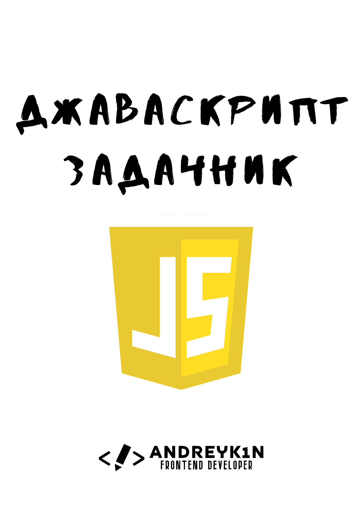

# 🟨🟦 JS-practice – Колекція завдань з JavaScript

Ласкаво просимо до **JS-practice** — репозиторію з практичними завданнями з **JavaScript** 🚀  
Цей проєкт створено для тих, хто хоче покращити свої навички програмування: від базових конструкцій до складних алгоритмів та міні-проєктів.

---

## 📖 Для кого цей репозиторій?

- Для **початківців** — щоб закріпити базу (змінні, умови, цикли).  
- Для **тих, хто вже пише на JS** — щоб прокачати розуміння масивів, об’єктів, DOM та подій.  
- Для **досвідчених** — щоб розв’язувати задачі на асинхронність, алгоритми, оптимізацію та патерни.  
- Для **викладачів/менторів** — щоб використовувати набір завдань як тренувальні матеріали.  

---

## 📂 Структура репозиторію

```bash
js-practice/
│
├── basic/                           # Базові завдання
│   ├── variables/                   # Змінні (усі задачі тут)
│   ├── operators/                   # Оператори (арифметичні, логічні, порівняння)
│   ├── loops/                       # Цикли
│   │   ├── for/                     # простий for
│   │   ├── while/                   # while
│   │   ├── do-while/                # do-while
│   │   ├── break-continue/          # приклади break/continue
│   │   └── nested/                  # вкладені цикли
│   │
│   └── functions/                   # Прості функції (усі задачі тут)
│
├── intermediate/                    # Середній рівень
│   ├── arrays/
│   │   ├── basics/                  # створення, перебір
│   │   │   ├── creation/            # [], new Array, Array.of, Array.from
│   │   │   ├── iteration/           # for, for..of, forEach
│   │   │   └── push-pop/            # push, pop, shift, unshift
│   │   │
│   │   ├── methods/
│   │   │   ├── slicing/             # slice, splice
│   │   │   ├── checking/            # includes, some, every
│   │   │   ├── searching/           # indexOf, lastIndexOf, find
│   │   │   └── sorting/             # sort, reverse
│   │   │
│   │   ├── advanced/
│   │   │   ├── transformation/      # map, flatMap
│   │   │   ├── filtering/           # filter
│   │   │   ├── reduction/           # reduce, reduceRight
│   │   │   └── chaining/            # комбінування методів
│   │   │
│   │   └── multi-dimensional/       # двовимірні масиви
│   │
│   ├── objects/
│   │   ├── basics/
│   │   │   ├── creation/            # літерали, new Object()
│   │   │   ├── access/              # доступ до властивостей (dot, bracket)
│   │   │   └── modification/        # додавання/видалення властивостей
│   │   │
│   │   ├── nested/
│   │   │   ├── access/              # доступ до вкладених властивостей
│   │   │   └── modification/        # зміна вкладених об’єктів
│   │   │
│   │   ├── methods/
│   │   │   ├── custom-methods/      # створення методів у об’єктах
│   │   │   └── this-keyword/        # робота з this
│   │   │
│   │   ├── destructuring/
│   │   │   ├── basics/              # просте розпакування
│   │   │   └── nested/              # деструктуризація вкладених об'єктів
│   │   │
│   │   ├── iteration/
│   │   │   ├── for-in/              # цикл for..in
│   │   │   ├── object-keys/         # Object.keys
│   │   │   ├── object-values/       # Object.values
│   │   │   └── object-entries/      # Object.entries
│   │   │
│   │   ├── comparison/
│   │   │   ├── shallow/             # порівняння посилань, ==
│   │   │   └── deep/                # глибоке порівняння
│   │   │
│   │   ├── merging-cloning/
│   │   │   ├── assign/              # Object.assign
│   │   │   ├── spread/              # spread operator
│   │   │   └── structured-clone/    # структуроване клонування
│   │   │
│   │   └── classes/
│   │       ├── basics/              # оголошення класів, конструктор
│   │       ├── inheritance/         # extends, super
│   │       └── static-private/      # static, приватні поля
│   │
│   ├── dom/
│   │   ├── selection/               # getElementById, querySelector
│   │   ├── manipulation/
│   │   │   ├── content/             # innerHTML, textContent
│   │   │   ├── attributes/          # setAttribute, getAttribute
│   │   │   ├── styles/              # style, classList
│   │   │   └── classes/             # add, remove, toggle
│   │   │
│   │   ├── traversal/               # parentElement, children, siblings
│   │   ├── creating-elements/
│   │   │   ├── create/              # createElement
│   │   │   ├── insert/              # append, prepend, insertBefore
│   │   │   └── remove/              # remove, replaceChild
│   │   │
│   │   └── events-binding/          # onClick vs addEventListener
│   │
│   └── events/
│       ├── basics/                  # addEventListener, onclick
│       ├── keyboard/
│       │   ├── keydown-keyup/       # події keydown, keyup
│       │   └── keypress/            # подія keypress (застаріла, для ознайомлення)
│       │
│       ├── mouse/
│       │   ├── clicks/              # click, dblclick
│       │   ├── movement/            # mouseover, mouseout, mousemove
│       │   └── buttons/             # mousedown, mouseup, contextmenu
│       │
│       ├── forms/
│       │   ├── input-change/        # input, change
│       │   ├── submit-reset/        # submit, reset
│       │   └── focus-blur/          # focus, blur
│       │
│       └── other/                   # scroll, resize, load
│
└── hard/                            # Складний рівень
    ├── async/
    │   ├── promises/                # Promise, chaining
    │   ├── async-await/             # async/await
    │   └── fetch-api/               # робота з fetch
    │
    ├── algorithms/
    │   ├── sorting/                 # bubble, quick, merge
    │   ├── searching/               # binary search, linear search
    │   └── logic-puzzles/           # задачі на логіку та математику
    │
    ├── patterns/
    │   ├── design-patterns/         # singleton, observer, factory
    │   └── functional/              # high-order functions, closures, currying
    │
    └── projects/
        ├── mini-apps/               # маленькі інтерактивні проєкти
        ├── games/                   # невеликі ігри
        └── utilities/               # корисні скрипти та інструменти


```
